**How to setup a Jenkins production and testing pipeline using
docker??**

Assumptions: Jenkins And Docker are installed in RHEL OS

Jenkins is added in sudoers file.

User has a Github Profile and Git Bash is Installed

\#NOTE THIS Document is in 2 Parts for those who know how to use git can
directly skip to that

1\. Create a folder on your preferred place

2.Create a index.html file and write something in it .

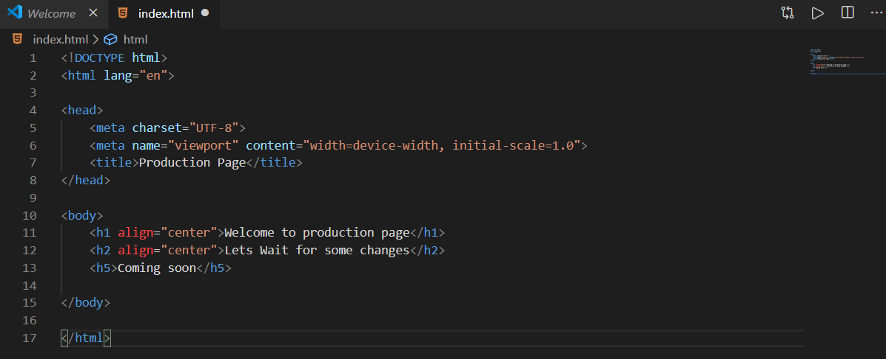{width="5.685416666666667in"
height="2.313041338582677in"}

This is my Index.html file for testing

3.Open Git bash where your file is located

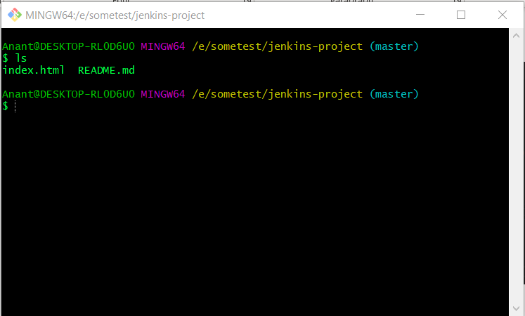{width="5.685499781277341in"
height="3.425in"}

4\. Create a git repository

{width="5.680608048993876in"
height="4.15in"}

5.Paste the command on the git terminal you opened in previous step
(step 4)

6\. Now create development branch by typing:

Git branch development

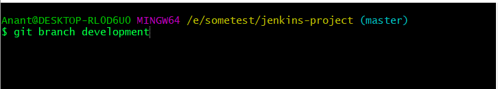{width="5.541666666666667in"
height="0.9999431321084864in"}

To check this branch type git checkout \<branch name\>

Here my branch name is developer

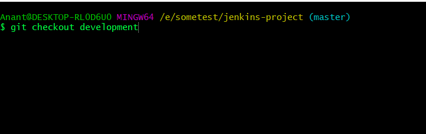{width="5.541666666666667in"
height="1.744740813648294in"}

Screen will look something like this

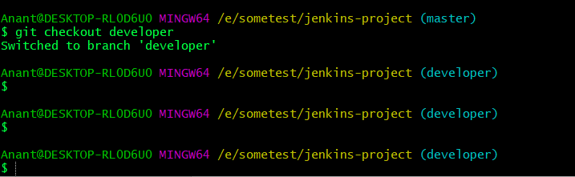{width="5.541666666666667in"
height="1.7081014873140858in"}

7\. Edit the code in this branch

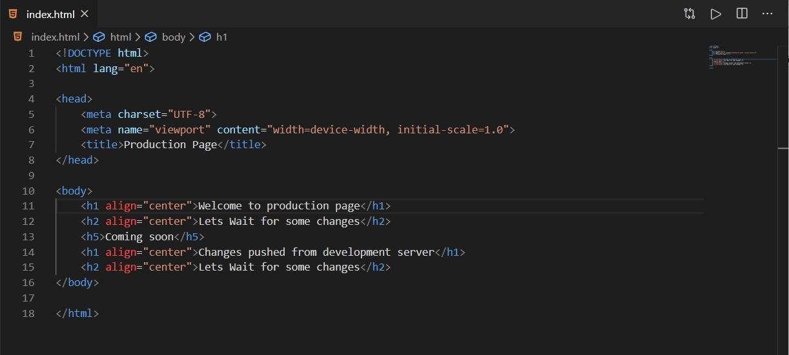{width="5.8037915573053365in"
height="2.6166666666666667in"}

8\. Add and commit the code

Git add .

Git commit -m "message"

Git checkout master

9\. Git push --all (this will push all branches into github)

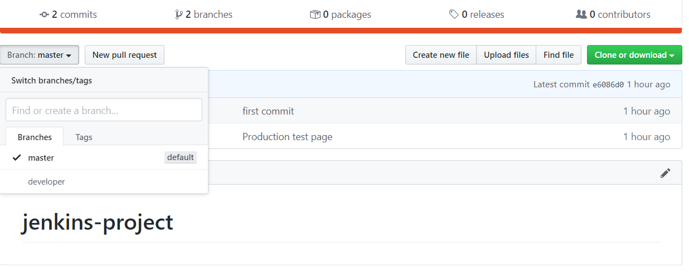{width="5.675in"
height="2.2542366579177604in"}

**FOR THOSE WHO KNOW THE ABOVE BASICS**

**PART 2**

Now we need to setup Jenkins for the job

Fire up Jenkins

I will be doing the this task in 4 Steps

Step 1:

Create Job1 with following configuration

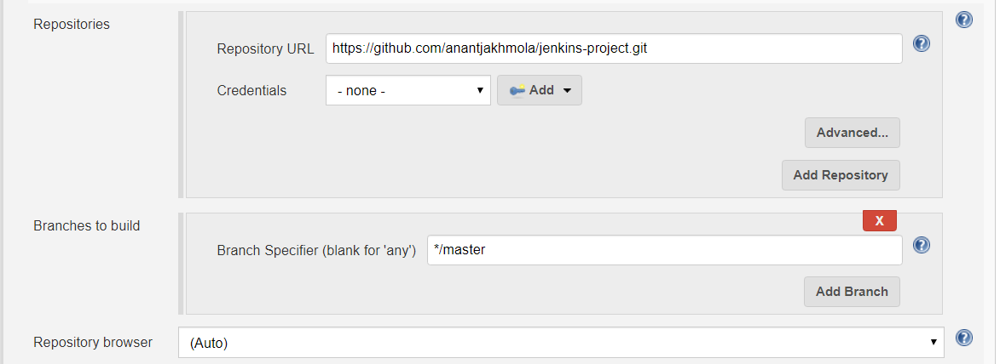{width="5.687261592300962in"
height="2.075in"}

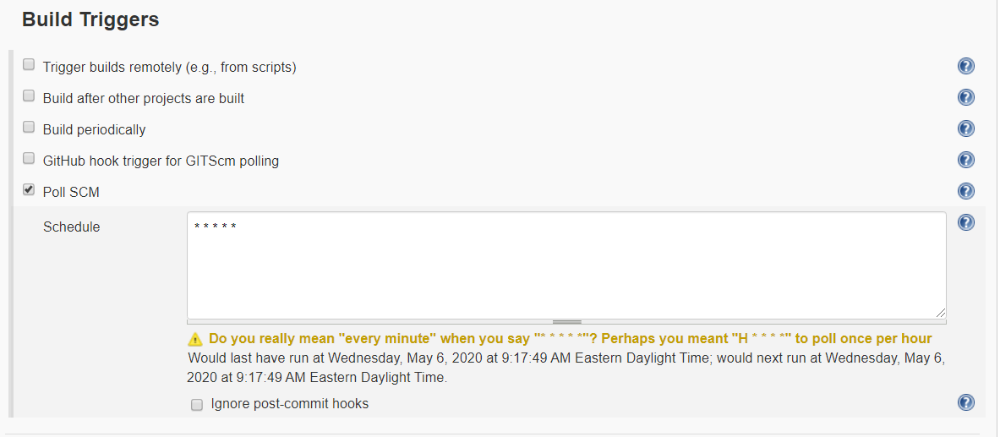{width="5.683129921259843in"
height="2.4833333333333334in"}

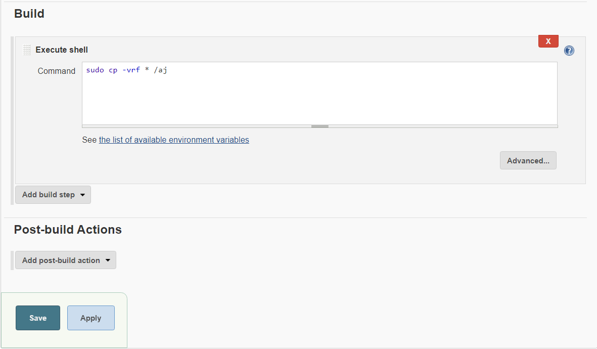{width="5.648865923009624in"
height="3.3in"}

Save the job

STEP 2:

Create another job for production server

{width="5.687261592300962in"
height="2.075in"}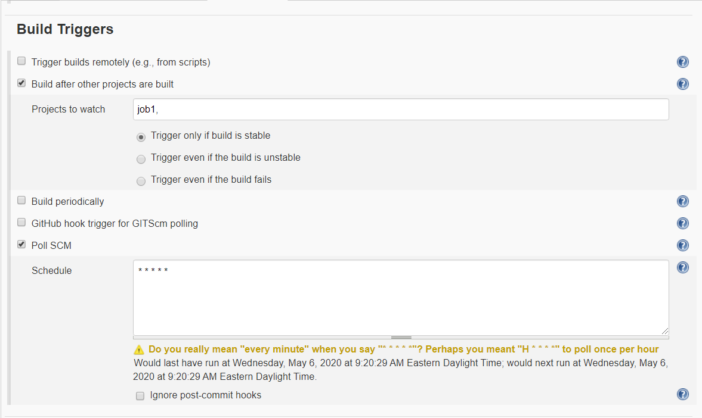{width="5.700694444444444in"
height="3.399708005249344in"}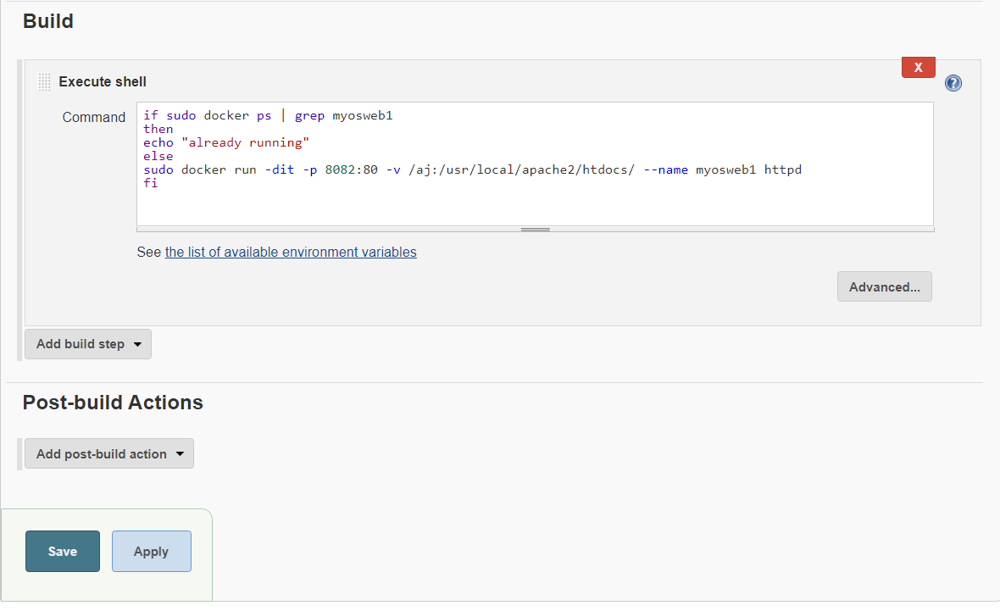{width="5.700996281714786in"
height="3.4833333333333334in"}

Save the job

STEP 3

For Development Environment

Create a job name gitup-test.

***\#NOTE REPLACE the master with your development branch below.***

{width="5.65in"
height="2.061405293088364in"}

{width="5.65in"
height="2.468857174103237in"}

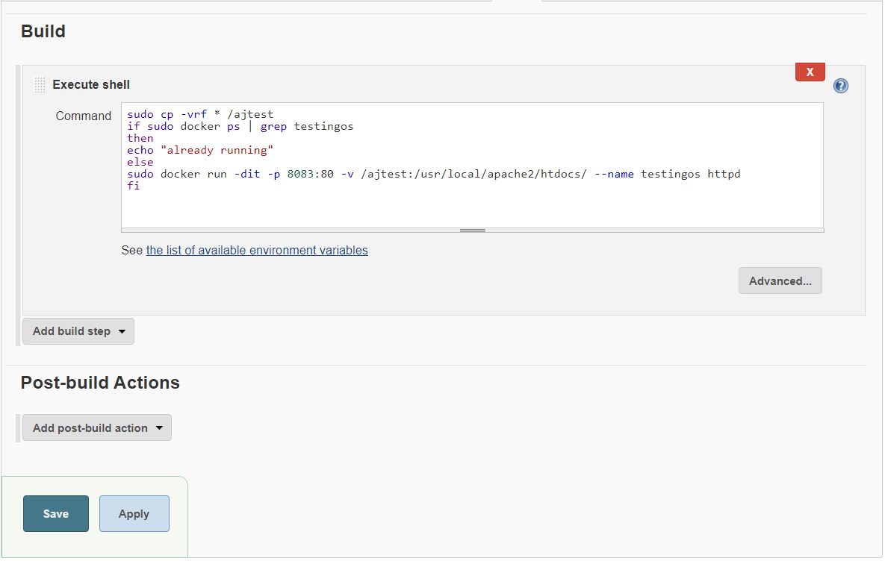{width="5.375in"
height="3.4104844706911637in"}

Step 4

Create a job QA-approved

Don't forget to give your credentials here

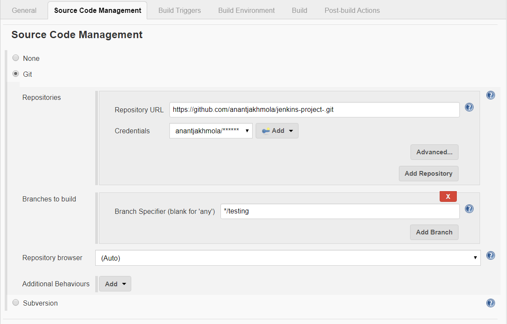{width="5.355496500437446in"
height="3.425in"}

\# go to post build section

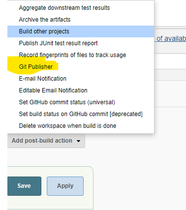{width="3.1502734033245843in"
height="3.5586417322834647in"}

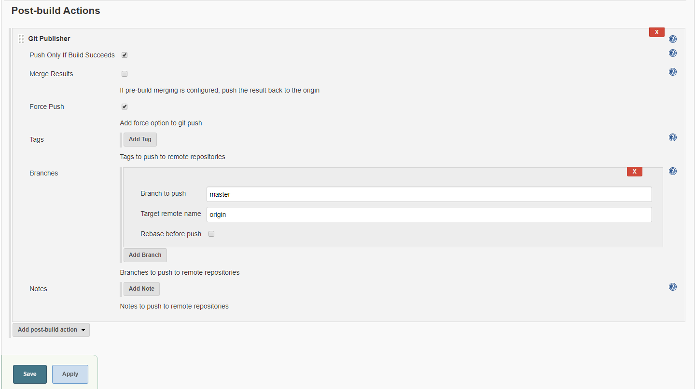{width="6.276930227471566in"
height="3.517361111111111in"}

KUDOS YOU ACHIEVED IT

This is how the index page in production looks like

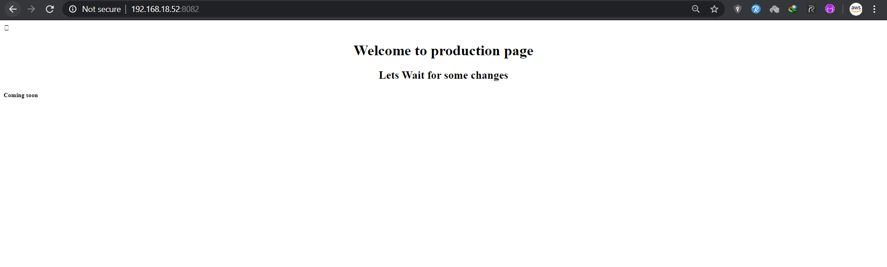{width="6.5in"
height="1.9631944444444445in"}

This is what development server looks like

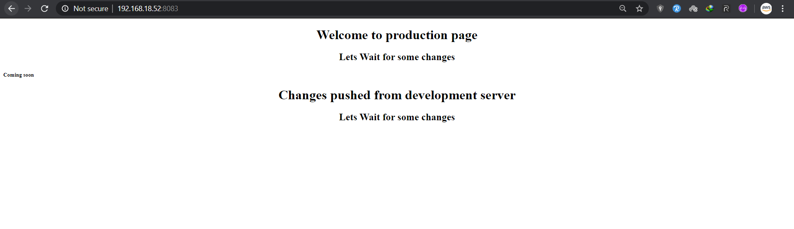{width="6.5in"
height="1.8819444444444444in"}

Once the QA team test the code they will start the QA-test job white we
configured at PART2: STEP 4

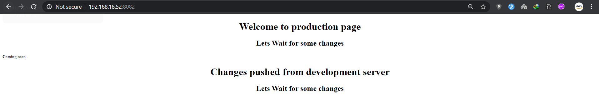{width="6.5in"
height="1.1694444444444445in"}

This will update the Ip , you can also do the jobs using HOOKS

This is what Docker looks like after this process

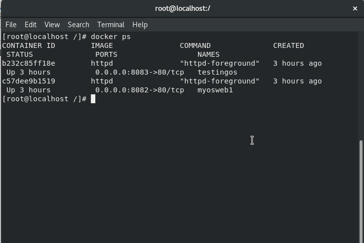{width="6.142199256342957in"
height="4.100355424321959in"}
