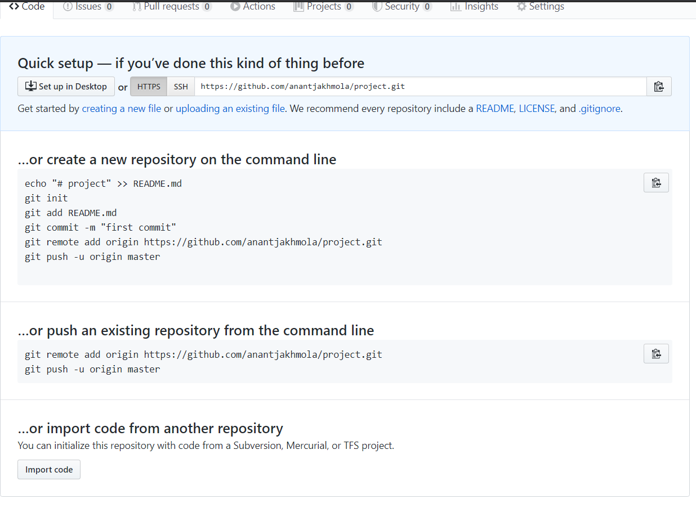

**How to setup a Jenkins production and testing pipeline using
docker??**

Assumptions: Jenkins And Docker are installed in RHEL OS

Jenkins is added in sudoers file.

User has a Github Profile and Git Bash is Installed

\#NOTE THIS Document is in 2 Parts for those who know how to use git can
directly skip to that

1\. Create a folder on your preferred place

2.Create a index.html file and write something in it .

This is my Index.html file for testing

3.Open Git bash where your file is located

4\. Create a git repository

5.Paste the command on the git terminal you opened in previous step
(step 4)

6\. Now create development branch by typing:

Git branch development

To check this branch type git checkout \<branch name\>

Here my branch name is developer

Screen will look something like this

7\. Edit the code in this branch

8\. Add and commit the code

Git add .

Git commit -m "message"

Git checkout master

9\. Git push --all (this will push all branches into github)

**FOR THOSE WHO KNOW THE ABOVE BASICS**

**PART 2**

Now we need to setup Jenkins for the job

Fire up Jenkins

I will be doing the this task in 4 Steps

Step 1:

Create Job1 with following configuration

Save the job

STEP 2:

Create another job for production server

Save the job

STEP 3

For Development Environment

Create a job name gitup-test.

***\#NOTE REPLACE the master with your development branch below.***

Step 4

Create a job QA-approved

Don't forget to give your credentials here

\# go to post build section

KUDOS YOU ACHIEVED IT

This is how the index page in production looks like

This is what development server looks like

Once the QA team test the code they will start the QA-test job white we
configured at PART2: STEP 4

This will update the Ip , you can also do the jobs using HOOKS

This is what Docker looks like after this process

